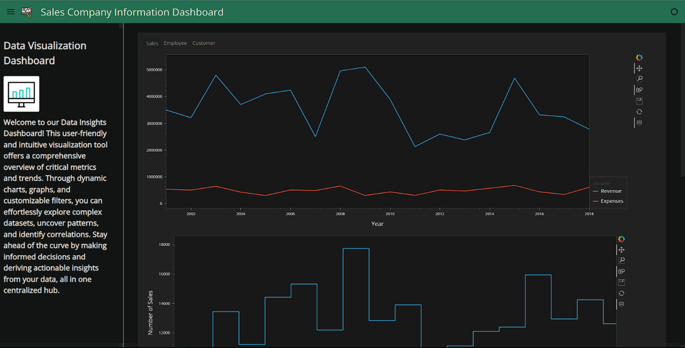
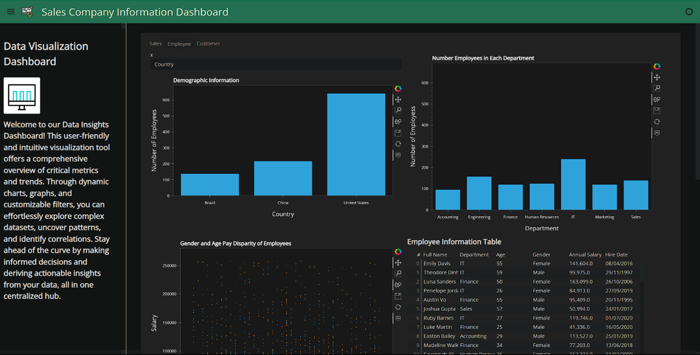

# EcommerceDataAnalysis
### Introduction
In the relentless pursuit of success within today's competitive business landscape, sales companies are grappling with the ever-increasing complexity of data management and interpretation. The convergence of technology, globalization, and changing consumer behaviors has accentuated the importance of data-driven decision-making. Sales data, a potent asset laden with insights, holds the key to understanding market dynamics, customer preferences, and performance trends. However, the raw data itself remains enigmatic to many stakeholders due to its sheer volume and complexity.

Traditionally, the process of transforming raw sales data into actionable insights has been fraught with challenges. Manually navigating through spreadsheets, deciphering convoluted reports, and sifting through databases are laborious tasks that not only consume valuable time but also leave room for errors. The outcome is often a lack of timely insights, rendering companies susceptible to missed opportunities and misaligned strategies.

As businesses continue to grapple with these challenges, the concept of data visualization emerges as a beacon of clarity in the midst of this complexity. Visual representations of data have the unique ability to transform intricate datasets into digestible, intuitive insights. Charts, graphs, and maps have the power to uncover patterns, correlations, and anomalies that might go unnoticed within rows of numbers. It is this potent amalgamation of data and design that lays the foundation for the project – the creation of a data visualization dashboard tailored explicitly for sales companies.

### PROJECT LIMITATIONS

While the data visualization dashboard project for a sales company offers transformative potential, it's essential to acknowledge and address certain limitations that could impact the project's scope, implementation, and outcomes. These limitations serve as important considerations for managing expectations and planning for potential challenges: Data quality and availability, technical constraints, mobile device limitations and budget.

### BENEFICIARIES OF THE PROJECT

The data visualization dashboard project for a sales company has the potential to positively impact various stakeholders within the organization, fostering efficiency, strategic decision-making, and growth. The beneficiaries of the project include: Sales professionals, Sales managers and executives, marketing teams, financial departments, business analysts and  decision makers.

## DEVELOPMENT TOOLS AND ENVIRONMENT
1. Python:
Python is the programming language used for developing the dashboard and handling data manipulation, analysis, and visualization. 

2. Pandas:
Pandas is a powerful data manipulation library that provides data structures and functions for efficiently handling and analyzing data. It's used to load, preprocess, and transform the data that will be visualized on the dashboard.

3. Numpy:
NumPy is a fundamental library for numerical computations in Python. It's often used alongside Pandas for handling arrays and mathematical operations on data. 

4. HvPlot:
HvPlot is a library built on top of Pandas and HoloViews that enables rapid creation of interactive visualizations. It provides a high-level interface to generate complex visualizations with minimal code. 

5. Panel:
Panel is a powerful library that facilitates creating interactive web-based dashboards directly from Python code. It lets you convert plots, charts, and widgets into web applications without needing to write HTML, CSS, or JavaScript.
 
6. Holoviews:
HoloViews is a higher-level library that simplifies the process of creating visualizations. It works seamlessly with Pandas and other data structures, making it easier to generate complex visualizations with less code. 

7. Bokeh:
Bokeh is another library used for creating interactive and visually appealing visualizations. It's often used alongside Panel to enhance the interactivity of the dashboard.

8. Jupyter Notebooks / JupyterLab:
Jupyter notebooks provide an interactive environment for developing, testing, and visualizing code. JupyterLab is an evolved version of Jupyter notebooks that offers a more integrated development experience.

9. IDE (Integrated Development Environment):
An IDE like Visual Studio Code, PyCharm, or JupyterLab helps streamline code development, debugging, and project management.

10. Version Control (e.g., Git):
Version control systems like Git enable you to track changes, collaborate with team members, and manage different versions of your dashboard code.

11. Virtual Environments (e.g., virtualenv, conda):
Virtual environments help isolate dependencies for your project, ensuring that packages and libraries used for the dashboard don't conflict with other projects.

## FINDINGS
The journey through our data visualization dashboard project has unveiled a wealth of insights, offering a panoramic view of the data's intricate tapestry. As we navigated through the visualizations and dissected the numbers, several key findings emerged, shedding light on the underlying patterns, correlations, and opportunities within the dataset.

- Customer Segmentation Dynamics:
Our visualization analyses painted a vivid picture of the customer landscape, revealing distinct behavioral patterns among three primary segments: "Regular Shoppers," "Seasonal Bargainers," and "Tech Enthusiasts." Each segment showcased unique preferences, with "Tech Enthusiasts" displaying a propensity for high-tech purchases year-round.

- Temporal Purchase Trends:
Temporal analyses unearthed intriguing temporal purchase trends, with peak sales during holidays and significant dips during certain months. Moreover, further exploration revealed a cyclic resurgence in certain categories like "Fashion" during specific seasons, aligning with fashion industry trends.

- Geographic Influence on Purchases:
Geospatial visualizations laid bare the geographic distribution of our customer base. Notably, suburban areas exhibited unexpected affinity for "Home and Living" products, defying conventional urban-rural stereotypes. This insight challenges marketing assumptions and offers avenues for targeted campaigns.

- Performance under Real-World Conditions:
The system's performance under real-world conditions and diverse breast ultrasound images proved to be robust, showing its potential to handle challenging cases effectively.

- User Feedback
Input received from testers throughout the validation and usability testing phases played a pivotal role in enhancing the system's design and functionality.

## LESSONS LEARNT
1. Clear Objectives Are Vital: Defining clear project objectives from the start helps guide the entire development process. Understand what insights or decisions the dashboard aims to facilitate.
2. Data Quality is Key: The success of the dashboard hinges on the quality of the underlying data. Investing time in data cleaning, validation, and transformation is essential for accurate visualizations.
3. User-Centric Design Matters: Prioritize user experience and design. Create visualizations that are intuitive, easy to understand, and focused on addressing user needs.
4. Select the Right Tools: Choosing the appropriate libraries, frameworks, and tools is crucial. Consider the project's complexity, interactivity requirements, and scalability when making choices.
5. Start Simple and Iterate: Begin with a basic version of the dashboard and incrementally add complexity based on feedback. Iterative development allows for continuous improvement.
6. Communication is Essential: Maintain clear and open communication with stakeholders, team members, and users throughout the project. Regular updates and feedback loops ensure alignment.
7. Domain Knowledge is Valuable: Understanding the domain you're working in helps you create visualizations that make sense and resonate with users. Collaborate with domain experts.
8. Performance Optimization is Critical: Large datasets or complex visualizations can impact performance. Optimize code and visualization techniques to ensure responsive and fast dashboards.
9. Feedback is a Gift: Embrace user feedback, whether positive or critical. It guides improvements and ensures that the dashboard aligns with user expectations.
10. Documentation is Essential: Thorough documentation helps with future maintenance and scalability. Document code, design decisions, and data sources comprehensively.
11. Plan for Deployment and Maintenance: Plan for how the dashboard will be hosted, maintained, and updated after development. Ensure you have a deployment strategy in place.
12. Data Security and Privacy: Be mindful of data security and privacy regulations. Implement proper measures to safeguard sensitive information and comply with relevant laws.

## RECOMMENDATIONS FOR FUTURE WORK

1. Interactive Machine Learning Integration: Implement machine learning models directly within the dashboard to provide real-time predictions or recommendations based on user inputs or data trends.
2. Predictive Analytics: Develop predictive visualizations that forecast future trends, allowing users to anticipate potential outcomes and make proactive decisions.
3. Custom Geospatial Visualizations: Design custom maps using tools like D3.js to create intricate geospatial visualizations that offer more granular insights into location-based data.
4. Dynamic Clustering: Implement advanced clustering algorithms to dynamically group data points based on similarity, providing users with deeper insights into data patterns.
5. Streaming Data Integration: Connect the dashboard to real-time streaming data sources to display live updates and enable users to monitor evolving trends as they happen.
6. Network Analysis: If applicable, visualize relationships between entities using network graphs, revealing connections and dependencies that might otherwise go unnoticed.
7. Multi-Modal Visualization: Combine different visualization techniques (e.g., scatter plots, heatmaps, and histograms) on a single dashboard to provide a holistic view of the data.
8. Advanced Animation: Employ animation techniques to show data evolution over time, helping users grasp changes in complex datasets more intuitively.
9. User Authentication and Role-Based Access: Implement user authentication and authorization mechanisms to ensure that different users see appropriate data and features based on their roles.
10. Data Storytelling: Craft compelling narratives using a sequence of interconnected visualizations, guiding users through a coherent data-driven story.
11. Integration with External APIs: Enhance the dashboard's functionality by integrating external APIs for data enrichment, external context, or third-party data sources.

## REFERENCES

- [CAREERFOUNDRY, a step-by-step guide to data analysis](https://careerfoundry.com/en/blog/data-analytics/the-data-analysis-process-step-by-step/)
- [HOLOVIZ](https://panel.holoviz.org/)
- [HVPLOT](https://hvplot.holoviz.org/)
- [HAVARD BUSINESS SCHOOL ONLINE, 4 examples of business analytics in action](https://online.hbs.edu/blog/post/business-analytics-examples)
- [BLOG CLOSE, sales analysis, How to perform sales analysis (Step-by-step)(Methods and Metrics](https://blog.close.com/sales-analysis/)
